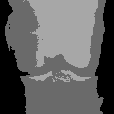
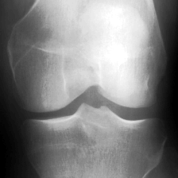
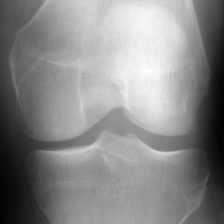

# Hi, I'm Mgani41! 👋


# 🔖Title

Design and development of classification model for the knee osteoarthritis


## ⚠️Dataset


- Download the dataset for custom training
- https://nda.nih.gov/oai/


## 👀Features

- Multivariate linear regression
- Circular fourier transformation
- Histogram equalization and quantization

## 📷Image Results
- Original Image


- Segmented Image




- Circular fourier transformation Image


- Histogram quantization Image


- Histogram equalization Image




- Multivariate linear regression Image





## 🏃‍♂️Run Locally

Clone the project

```bash
  git clone https://github.com/Mgani41/Knee-Osteoarthritis-Classification.git
```

Go to the project directory

```bash
  cd Knee-Osteoarthritis-Classification
```


## 🛠 Skills
Python, Matlab, HTML, Javascript...


  

